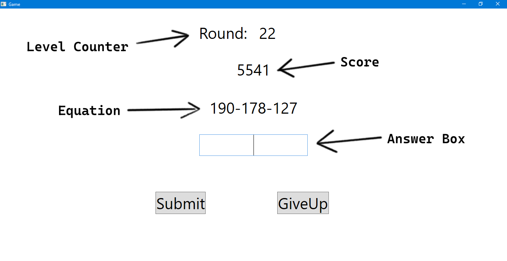

# A simple randomly generated game
## WPF micro-project by Reegan Anto.J

#### Introduction:
This is a simple game made using WPF. I primarily focused on learning multithreading and random equation generation on this.

The game is to answer the given equation within a stipulated amount of time.
The equations in the game are randomly generated and gets progressively harder based on level.
Any wrong answer will end the game, top 10 scores will be added to a leaderboard.

I am a third year student in the Artificial Intelligence and Data Science department of Adhi College of Engineering and Technology, and would appreciate any help you could provide me which could potentially improve my skills.

#### Key skills I applied in this project (In my humble opinion):
- Multi Threading
- Windows Presentation Foundation
- Object Oriented Programming
- Random Number Generator
- Difficulty Scaling

# Game Explanation:

